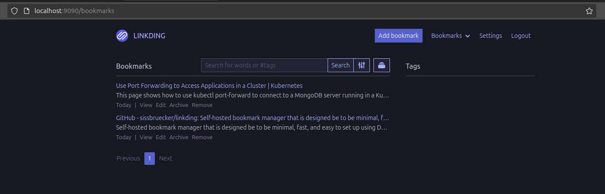

# Linkding on Kubernetes

Following up on Mischa's Kubernetes Fundamentals course, I'll try this experiment he suggested. I'll deploy Linkding, a self-hosted bookmark manager.

The original repository: [Linkding](https://github.com/sissbruecker/linkding)

